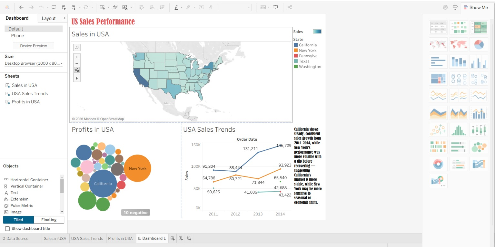
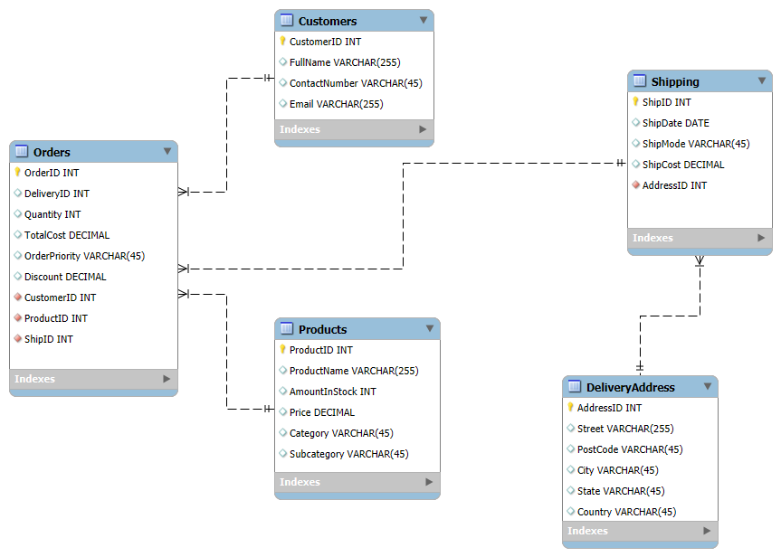
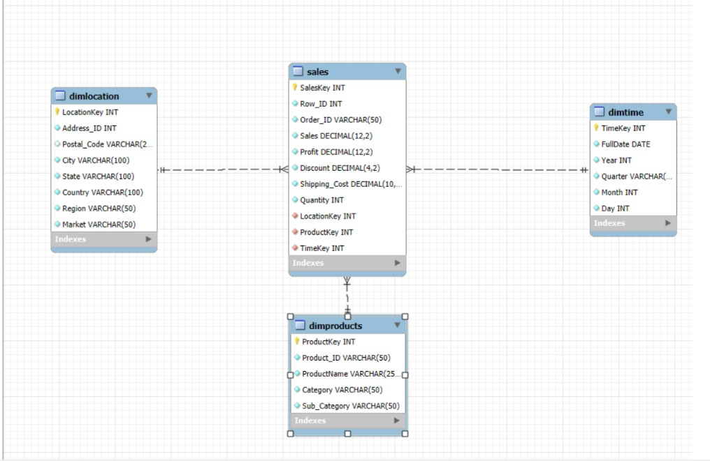

# 📊 Advanced Data Modeling — Global Superstore

Raw sales data, transformed through a full database design pipeline: normalized schema → dimensional star schema → interactive dashboard.

**🔗 Live dashboard:** [GlobalSuperStore on Tableau Public](https://public.tableau.com/app/profile/md.faisal.alam6840/viz/GlobalSuperStore_17888527610020/Dashboard1)

---

## What this project shows

Most beginner data projects start with a clean CSV and jump straight to charts. This one starts a step earlier — with raw, denormalized data — and shows the full design process a real analytics system goes through:

1. **Design a normalized relational schema** for transactional integrity (no duplicate/inconsistent data)
2. **Transform it into a star schema** — the dimensional model used by BI tools for fast analytical queries
3. **Build a dashboard** on top, with real written insights, not just default charts

---

## Entity-relationship diagram (normalized schema)

Five related tables — `Customers`, `Products`, `Orders`, `Shipping`, `DeliveryAddress` — each holding one entity's data exactly once, connected via foreign keys. This avoids repeating customer or product details across every order row.

## Star schema (dimensional model)

The normalized tables are then reshaped into a **fact table** (`Sales`, holding the numeric measures — price, cost, quantity, shipping) surrounded by three **dimension tables** (`DimTime`, `DimLocation`, `DimProducts`) holding the descriptive attributes used for filtering and grouping. This is the structure BI tools like Tableau are optimized to query quickly.

---

## Pipeline

1. **Raw data** — Global Superstore sales data (Excel)
2. **Normalize** — designed into a 5-table relational schema (`create_database.sql`), enforcing no data duplication
3. **ETL into star schema** — `Step3_StarSchema.sql` extracts from the normalized tables, transforms the shape, and loads it into `Sales` + 3 dimension tables
4. **Verify** — queries run and joined successfully against the star schema (see `star_schema_verification.jpg`)
5. **Visualize** — the same source dataset is connected to Tableau, producing an interactive dashboard with written analysis

---

## Tech stack

| Layer | Technology |
|---|---|
| Database design & modeling | MySQL, MySQL Workbench |
| Schema type | Normalized OLTP → Star schema (dimensional model) |
| Visualization | Tableau |
| Source data | Global Superstore dataset (Excel) |

---

## Run it locally

1. Open **MySQL Workbench**
2. Run `create_database.sql` — builds the normalized schema and tables
3. Run `Step3_StarSchema.sql` — transforms the normalized data into the star schema (fact + dimension tables)
4. Open `GlobalSuperStore.twb` in **Tableau Desktop** to view/edit the dashboard, or view it live on the [published link](https://public.tableau.com/app/profile/md.faisal.alam6840/viz/GlobalSuperStore_17888527610020/Dashboard1)

---

## Design decisions & trade-offs

- **Validated the star-schema ETL on a representative sample before scaling** — confirming the transformation logic (joins, key mapping, aggregation) works correctly on a small, verifiable dataset first, rather than running an unverified transformation against the full dataset. Standard practice before a full production run.
- **The dashboard and the database layer are kept as separate, composable stages** — Tableau connects to the cleaned source data directly, while the MySQL schema/ETL work demonstrates the data modeling layer independently. This separation mirrors how real analytics stacks decouple the data warehouse layer from the BI layer, rather than hard-coupling one tool to one specific database.

## Future improvements

- Connect Tableau directly to the star-schema MySQL database, unifying both stages into a single live pipeline
- Run the validated ETL logic against the full dataset and benchmark query performance (star schema vs. normalized schema) on a real analytical question
- Automate the ETL as a scheduled job rather than a manual script run

---

## Built by

**Faisal** — [GitHub](https://github.com/faisal-devvv)
